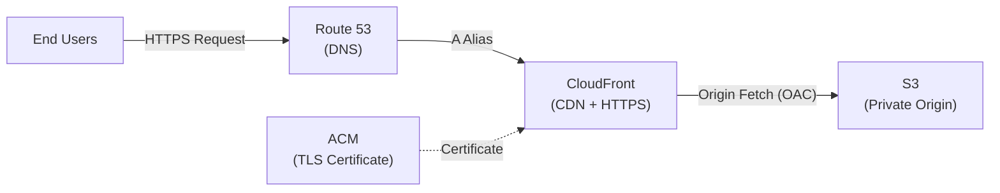

# Portfolio — Itai Picornell

## About

Personal portfolio built as a **Single-Page Application (SPA)** with Vue 3 and Vite, hosted statically on AWS. The compiled assets are served through CloudFront and stored in a private S3 bucket. Deployments are automated with GitHub Actions.

## Infrastructure

The application runs on the following AWS services:

| Service | Role |
|---|---|
| **Amazon Route 53** | DNS management. Points the custom domain to the CloudFront distribution via an `A` alias record. |
| **Amazon CloudFront** | CDN. Caches and serves the static files from edge locations, enforcing HTTPS-only traffic. |
| **AWS Certificate Manager (ACM)** | Provides the SSL/TLS certificate attached to CloudFront for HTTPS. Renewal is automatic. |
| **Amazon S3** | Origin storage. Holds the compiled static assets in a private bucket. Public access is blocked — CloudFront reaches S3 through an Origin Access Control (OAC) policy. |

### Architecture Diagram

## CI/CD Pipeline

A GitHub Actions workflow runs on every push to `main` that changes files in `frontend/` or `.github/`. It does the following:

1. **Checkout** — Clones the repository.
2. **Setup Node.js 20** — Configures the runtime with npm cache from `package-lock.json`.
3. **Install dependencies** — Runs `npm ci` for a clean, reproducible install.
4. **Build** — Compiles the source into fingerprinted static assets (`npm run build`).
5. **AWS authentication** — Loads IAM credentials from encrypted GitHub Secrets.
6. **Sync assets to S3** — Uploads hashed files (JS, CSS, images) with a 1-year `immutable` cache header. Obsolete files are deleted with `--delete`.
7. **Upload `index.html`** — Deployed separately with `no-cache` headers so browsers always fetch the latest version.
8. **Invalidate CloudFront cache** — Issues a full invalidation (`/*`) so updated content is served from all edge locations.

## License

This project is licensed under the [MIT License](LICENSE).
